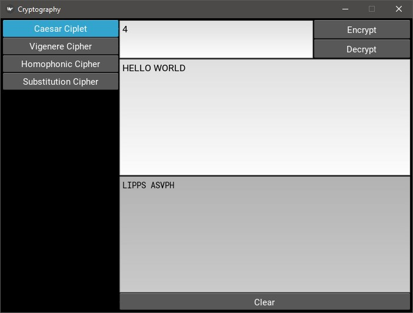
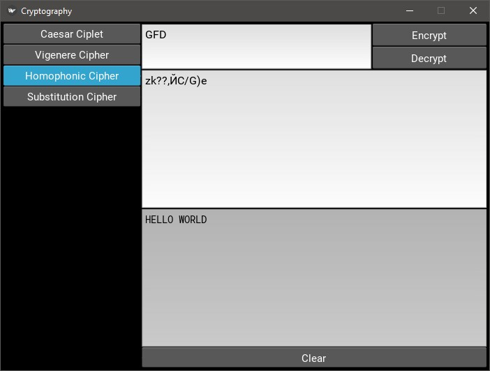

# Cryptography</br>

This is an application that can encode and decode text using different ciphers.
This app is written using Python and the Kivy framework.</br>




# Download & Setup Instructions :
* Clone the project. This will download the GitHub respository files onto your local machine.</br>
```Shell
git clone https://github.com/teredet/Cryptography
```
* Create a virtual environment and activate
```Shell
    pip install virtualenv
    python -m virtualenv envname
    envname\scripts\activate
```
* Install requirements
```Shell
    cd Cryptography
    pip install -r requirements.txt
```
* Run program
```Shell
    python main.py
```

# Features
 Cipher implementation:
* Caesar Сiplet
* Vigenere Сipher
* Homophonic Substitution Cipher
* Substitution Cipher


# Tech Stack
* Python
* Kivy

</br>

